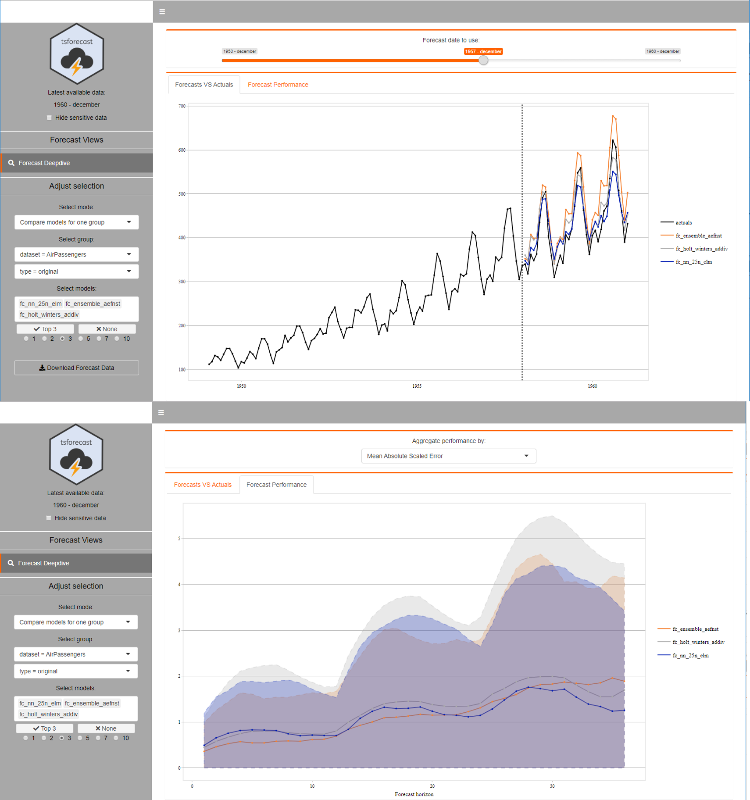

---
output:
  github_document:
    html_preview: false
---

<!-- README.md is generated from README.Rmd. Please edit that file -->

```{r, echo = FALSE}
knitr::opts_chunk$set(
  collapse = TRUE,
  comment = "#>",
  fig.path = "README-"
)
options(
  tibble.print_min = 5, 
  tibble.print_max = 5, 
  tibble.width = Inf
)
```

# 

[](https://www.tidyverse.org/lifecycle/#stable)

* [Overview](#overview)
* [Features](#features)
* [Installation](#installation)
* [How to use](#how_to_use)
* [Contribute](#contribute)
* [Acknowledgments](#acknowledgments)

## Overview<a name="overview"></a>

tsforecast contains a set of R functions that can be used to do time series forecasting on monthly data, for the following cases:

* Univariate forecasting:
    + Time series forecasting without external regressors (so regressing on the observations themselves)
 
* Multivariate forecasting:
    + Time series forecasting including external regressors (a.k.a. predictor/feature variables or covariates)

***

The package attempts to streamline the process of doing time series forecasting in R by abstracting away some of the technicalities, such as:

* Creating time series objects from your data
* Splitting up the time series objects into train and test sets using a sliding window
* Comparing the performance of multiple algorithms at one go, such as:
    + Simple heuristics (e.g. mean and drift models)
    + 'Classic' econometric methods (e.g. ARIMA and Holt-Winters)
    + Machine Learning algorithms (e.g. neural networks and random forests)
    + ... and more (e.g. Prophet)
* Allow for easy analysis of the results in an interactive dashboard

***

For more information on definitions, available forecast models and their implementation in the tsforecast package, check out the documentation by either:

* Running the `show_documentation()` function after [installing](#installation) and loading the package
* Manually downloading [this file](inst/documentation/forecast_models.html) from Github and opening it in your browser (until Github makes it possible to view rendered html ...)

The original developers of this R package are [Gertjan van den Bos](mailto:gertjan.bos@ing.com), [Mehmet Kutluay](mailto:yasar.kutluay@ing.com), [Olle Dahlen](mailto:olle.dahlen@ing.com), [Miel Verkerken](mailto:mielverkerken@hotmail.com) & [Han Lin](mailto:han.lin@ing.com)

## Features<a name="features"></a>

The following functions are available within the time series forecasting framework in this R package.

* Create forecasts:
    + `update_main_forecasting_table()`<a name="update_main_forecasting_table"></a>: is a wrapper function around the following functions, to EITHER initialize a set of new forecasts (and write these to disk for reuse later on) OR update an existing set of forecasts (that was previously stored on disk to prevent recalculation) with new forecasts that can be created as new data becomes available:
        - `create_main_forecasting_table()`<a name="create_main_forecasting_table"></a>: is a function to create a table in which every row represents a different split of the data for time series forecasting.
        - `add_fc_models_to_main_forecasting_table()`<a name="add_fc_models_to_main_forecasting_table"></a>: is a function to extend the main forecasting table with an additional column, called fc_models, in which all the specified forecast models per method are stored after they have been run (check the documentation for the available forecast models). The function will also extend the main forecasting table with another additional column, called fc_errors, which contains the forecast values, actuals and resulting forecast errors for every forecast model in the fc_models column.
    + `add_mean_ensemble_fc_methods()`<a name="add_mean_ensemble_fc_methods"></a>: is a function to create an ensemble forecast model, based on taking the mean of the forecasted values for a specfied selection of forecast models that are available in the main forecasting table. This approach is based on the knowledge that combining forecasts often leads to better forecast accuracy.
* Evaluate forecasts:
    + `get_forecast_accuracy_overview()`<a name="get_forecast_accuracy_overview"></a>: is a function to create an overview of the accuracy of the different forecast models in the main forecasting table.
    + `get_best_forecast_methods()`<a name="get_best_forecast_methods"></a>: is a function to determine the n best forecast methods from an (ordered) accuracy overview, when evaluating for a specific minimum and maximum number of periods ahead forecast horizon.
    + `start_forecast_analysis_dashboard()`<a name="start_forecast_analysis_dashboard"></a>: is a function to start an interactive Shiny dashboard that enables exploration of the individual forecasts versus actuals per split date, as well as an analysis of the overall forecast accuracy of the different forecast models.


***

If you want to learn more about which forecast models are available in the package, then please check out the documentation (after [installing](#installation) the package):
```{r, eval = FALSE}
# Open the documentation on the available forecast models in your browser
tsforecast::show_documentation(topic = "forecast_models")
```

***

If you want to see a quick demo of the available forecast methods on a public dataset, please run one or more of the examples (after [installing](#installation) the package):
```{r, eval = FALSE}
library(tsforecast)

# AirPassengers: The classic Box & Jenkins airline data. Monthly totals of international airline passengers, 1949 to 1960
run_example(dataset = "AirPassengers")

# nottem: A time series object containing average air temperatures at Nottingham Castle in degrees Fahrenheit for 20 years
run_example(dataset = "nottem")

# UKDriverDeaths: A time series giving the monthly totals of car drivers in Great Britain killed or seriously injured Jan 1969 to Dec 1984
run_example(dataset = "UKDriverDeaths")
```

These examples make use of the same Shiny dashboard as when using the `start_forecast_analysis_dashboard()` function:



## Installation<a name="installation"></a>

tsforecast is a package developed within ING and is not available on CRAN, but on [INGs github](https://github.com/ing-bank). 
You can install the package directly from github using the [devtools package](https://cran.r-project.org/web/packages/devtools/index.html), using:

```{r, eval = FALSE}
devtools::install_github("ing-bank/tsforecast")
```

Some prerequisites for installing the package:

* R version 3.6.0 or later
* Rtools installed ([How to?](https://thecoatlessprofessor.com/programming/installing-rtools-for-compiled-code-via-rcpp))

Any required packages that are missing from your R library should be automatically installed for you, otherwise please [install any missing packages](https://stat.ethz.ch/R-manual/R-devel/library/utils/html/install.packages.html) before using the tsforecast package.

**PLEASE NOTE**: *after installing the prophet package, you might need to call `library(prophet)` once in R for it to compile its model before you can use it!*

## How to use<a name="how_to_use"></a>

The package contains example data (a modified version of expsmooth::gasprice) that can be used to try out the package:
```{r, eval = TRUE}
library(tsforecast)
head(dummy_gasprice)
```

You need to initialize the data to be used within the time series forecasting framework (using [`initialize_ts_forecast_data()`](#initialize_ts_forecast_data) from the [tstools](https://github.com/ing-bank/tstools) package), by specifying which columns correspond to which required fields for the forecasting:
```{r, eval = TRUE}
# For UNIVARIATE forecasting
ts_forecast_data_univariate <- tstools::initialize_ts_forecast_data(
  data = dummy_gasprice, 
  # Indicate which Date column corresponds to the time component
  date_col = "year_month", 
  # Indicate which column of values should be forecasted
  col_of_interest = "gasprice",
  # OPTIONAL: Indicate which column(s) should be used to create groups to forecast separately
  group_cols = c("state", "oil_company")
)
head(ts_forecast_data_univariate)

# For MULTIVARIATE forecasting
ts_forecast_data_multivariate <- tstools::initialize_ts_forecast_data(
  data = dummy_gasprice, 
  date_col = "year_month", 
  col_of_interest = "gasprice", 
  group_cols = c("state", "oil_company"),
  # For multivariate forecasting, indicate which column(s) should be used as external regressors
  xreg_cols = c("spotprice", "gemprice")
)
head(ts_forecast_data_multivariate)
```

***

Using the wrapper function [`update_main_forecasting_table()`](#update_main_forecasting_table), which stores the main forecasting table on disk (to prevent lengthy recalculations and enable later expansion with new data and/or forecast methods):
```{r, eval = TRUE}
main_forecasting_table <- update_main_forecasting_table(
  # Change the path to write to a different location (instead of the current working directory)
  file_path = file.path(tempdir(), "example_forecast_file.rds"), 
  # Using the multivariate forecast data for this example, but univariate is also possible 
  data = ts_forecast_data_multivariate, 
  # Default is quarterly (every 3 months) and yearly (every 12 months) seasonality
  seasonal_periods = c(12,3), 
  # Default is 24 months (2 years) of miminum training period, but 180 month is used here to limit the runtime
  min_train_periods = 180, 
  # By default the training data is not limited
  max_train_periods = Inf, 
  # 12 months ahead forecasting is the default forecast horizon
  periods_ahead = 12, 
  # Limit the forecast methods to only two methods to limit the runtime
  fc_methods = c("linear", "prophet"),
  # Set to TRUE to get updates on progress
  verbose = FALSE
)
head(main_forecasting_table)
```

Alternatively, instead of using the wrapper function you can combine the underlying functions to achieve the same results (see [features](#features) for more information), as demonstrated below. However, you need to manually (re)store the main_forecasting_table to/from disk (using writeRDS() and readRDS()) if required, while the wrapper function handles this for you.

***

After initializing the forecast data, the main forecasting table can be created while specifying the requirements for the time series forecasts using the [`create_main_forecasting_table()`](#create_main_forecasting_table) function:
```{r, eval = TRUE}
main_forecasting_table <- create_main_forecasting_table(
  # Using the univariate forecast data for this example, but multivariate is also possible 
  data = ts_forecast_data_univariate, 
  # Default is quarterly (every 3 months) and yearly (every 12 months) seasonality
  seasonal_periods = c(12,3),
  # Miminum training period of 60 months (5 years) is used here
  min_train_periods = 5 * 12,
  # By default the training data is not limited
  max_train_periods = Inf
)
head(main_forecasting_table)
```

Initially, the main forecasting table only contains the settings and requirements for performing the time series forecasting. The forecast models, forecasts and resulting forecast errors are added using the [`add_fc_models_to_main_forecasting_table()`](#add_fc_models_to_main_forecasting_table) function:
```{r, eval = TRUE}
main_forecasting_table <- add_fc_models_to_main_forecasting_table(
  main_forecasting_table = main_forecasting_table, 
  # 12 months ahead forecasting is the default forecast horizon
  periods_ahead = 12,
  # Limit the forecast methods to only two methods to limit the runtime
  fc_methods = c("linear", "holt_winters"),
  # Set to TRUE to get updates on progress
  verbose = FALSE
)
head(main_forecasting_table)
```

***

With all the forecast models, forecasts and forecast errors available in the main forecasting table, it is now possible to calculate the forecast performance in terms of forecasting accuracy using the [`get_forecast_accuracy_overview()`](#get_forecast_accuracy_overview) function:
```{r, eval = TRUE}
accuracy_overview <- get_forecast_accuracy_overview(
  main_forecasting_table = main_forecasting_table,
  # By default, the Mean Absolute Error (MAE) is used to evaluate the forecast errors and rank the models
  metric = "MAE"
)
head(accuracy_overview)
```

Finally, we can use the overview of the forecast accuracy to determine (for each group) which are the top n best performing forecast methods according to our evaluation criteria (in this case Mean Absolute Error (MAE)) using the [`get_best_forecast_methods()`](#get_best_forecast_methods) function:
```{r, eval = TRUE}
get_best_forecast_methods(
  accuracy_overview = accuracy_overview,
  # Specify the top n forecast models to show, in this case only the best model per grouping is returned
  n = 1,
  # The minimum/maximum forecast horizon to consider when evaluating the forecast models, in this case all available forecast horizons are considered
  min_periods_ahead = 1,
  max_periods_ahead = Inf
)
```

For a more detailed analysis of the results, we can start an interactive Shiny dashboard which enables exploration of the individual forecasts versus actuals per split date, as well as an analysis of the overall forecast accuracy of the different forecast models, using the [`start_forecast_analysis_dashboard()`](#start_forecast_analysis_dashboard) function:
```{r, eval = FALSE}
start_forecast_analysis_dashboard(
  main_forecasting_table = main_forecasting_table
)
```

## Contribute<a name="contribute"></a>

- Idea? Please open an issue
- Bug? Please open an issue
- Want to contribute? Awesome! Please open an issue :)

## License<a name ="license"></a>

This package is free and open source software, licensed under GPL-3. More information can be found [here](https://www.gnu.org/licenses/gpl-3.0.en.html).

## Acknowledgments<a name="acknowledgments"></a>

This package relies heavily on a number of other packages which implement different kind of time series forecasting methods:

CRAN | Github | Background information 
------- | ------- | ------------------------------------------
[forecast](https://cran.r-project.org/web/packages/forecast/index.html) | [robjhyndman](https://github.com/robjhyndman/forecast) | [Forecasting: principles and practice](https://www.otexts.org/book/fpp) 
[prophet](https://cran.r-project.org/web/packages/prophet/index.html) | [facebook](https://github.com/facebook/prophet) | [Forecasting at scale](https://facebook.github.io/prophet/) 
[nnfor](https://cran.r-project.org/web/packages/nnfor/index.html) | [trnnick](https://github.com/trnnick/nnfor) | [Forecasting time series with neural networks in R](http://kourentzes.com/forecasting/2017/02/10/forecasting-time-series-with-neural-networks-in-r/) 
[rpart](https://cran.r-project.org/web/packages/rpart/index.html) | [cran](https://github.com/cran/rpart) | [An Introduction to Recursive Partitioning Using the RPART Routines](https://cran.r-project.org/web/packages/rpart/vignettes/longintro.pdf) 
[party](https://cran.r-project.org/web/packages/party/index.html) | [rforge](https://github.com/rforge/party) | [A Laboratory for Recursive Partytioning](http://party.r-forge.r-project.org/) 
[randomForest](https://cran.r-project.org/web/packages/randomForest/index.html) | [cran](https://github.com/cran/randomForest) | [Ensemble-of-trees-for-forecasting-time-series](https://petolau.github.io/Ensemble-of-trees-for-forecasting-time-series/) 
[forecastHybid](https://cran.r-project.org/web/packages/forecastHybrid/index.html) | [ellisp](https://github.com/ellisp/forecastHybrid) | [Forecast Combinations](https://robjhyndman.com/hyndsight/forecast-combinations/) 
[caret](https://cran.r-project.org/web/packages/caret/index.html) | [topepo](https://github.com/topepo/caret) | [_C_lassification _A_nd _RE_gression _T_raining](http://topepo.github.io/caret/index.html) 
[dlm](https://cran.r-project.org/web/packages/dlm/index.html) | [cran](https://github.com/cran/dlm) | [State space models in _dlm_](https://robjhyndman.com/talks/ABS3.pdf#page=32&zoom=100,0,-1) 
